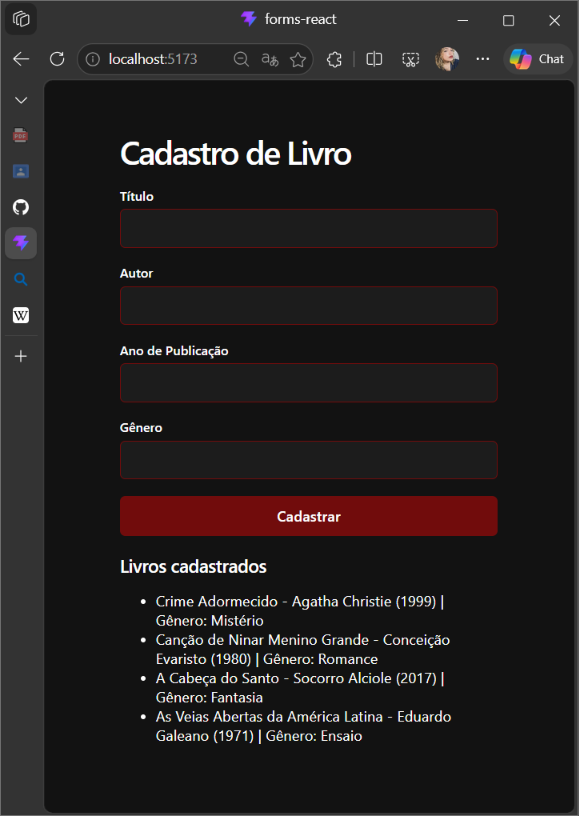

# 📚 Cadastro de Livros — IFRN Campus Pau dos Ferros

Projeto desenvolvido para a disciplina de Programação para Internet, como exercício de aprendizagem de componentes reutilizáveis, props e estado (`useState`) em React.
A aplicação permite cadastrar livros informando título, autor, ano de publicação e gênero, exibindo em seguida a lista de livros cadastrados.

## 🎯 Objetivo
Construir uma aplicação React de cadastro de livros, aplicando os conceitos de componentes reutilizáveis, `props` (sem desestruturação no parâmetro da função) e estado local com `useState`, seguindo a mesma estrutura do projeto de cadastro de alunos visto em aula.

🛠️ Tecnologias utilizadas

* React
* Vite
* JavaScript
* HTML
* CSS

## 📄 Funcionalidades do projeto

📝 Formulário de cadastro
 Permite preencher os campos **Título**, **Autor**, **Ano de publicação** e **Gênero**. Cada campo é controlado por um `useState` próprio, através do componente reutilizável `CampoTexto`.

📖 Lista de livros cadastrados
 Ao clicar em **Cadastrar**, um novo livro é criado (com identificador próprio gerado por `Date.now()`) e adicionado à lista, exibido pelo componente `Livro` no formato:
 `O Senhor dos Anéis — J.R.R. Tolkien — 1954 — Fantasia`
 Após o cadastro, os campos do formulário são limpos automaticamente.

📭 Lista vazia
 Caso nenhum livro tenha sido cadastrado ainda, é exibida a mensagem:
 `Nenhum livro cadastrado ainda.`

## 🖼️ Print da aplicação



▶️ Como rodar o projeto

1. Clone este repositório:
   ```
   git clone https://github.com/grazysss/formslivros-react.git
   ```
2. Acesse a pasta do projeto:
   ```
   cd formslivros-react
   ```
3. Instale as dependências:
   ```
   npm install
   ```
4. Rode o projeto em modo de desenvolvimento:
   ```
   npm run dev
   ```
5. Acesse no navegador o endereço exibido no terminal (geralmente `http://localhost:5173`).
